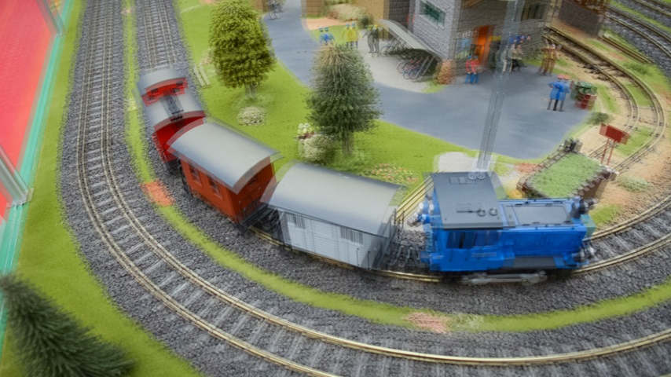

# Unified Arbitrary-Time Video Frame Interpolation and Prediction

<div align="center">
  
</div>

This project is the official implementation of our ICASSP 2025 paper, [Unified Arbitrary-Time Video Frame Interpolation
and Prediction](https://arxiv.org/pdf/2503.02316).

## Introduction

We present uniVIP - **uni**fied arbitrary-time **V**ideo **I**nterpolation and **P**rediction.  We would like to
highlight that:
- uniVIP is a simple and intuitive extension of
    the forward-warping-based frame interpolation model
    [UPR-Net](https://openaccess.thecvf.com/content/CVPR2023/papers/Jin_A_Unified_Pyramid_Recurrent_Network_for_Video_Frame_Interpolation_CVPR_2023_paper.pdf)
    . uniVIP is easy to implement, and can achieve excellent performance on both tasks (interpolation and prediction)
    with a single unified model.

- Technically, as shown by below figure, uniVIP extends the range of target time step from (0,1) to arbitrary value, and
explicitly embeds the task type (interpolation or prediction) into the synthesis module by adding a special task
channel.

<div align="center">
  
</div>


- uniVIP features **arbitrary-time** frame synthesis, and thus enables
 interesting applications like extended super-slow-motion. As shown below, given two input frames (first column), while
 conventional super-slow-motion algorithms can only synthesize in-between frames (second column), our uniVIP can produce
 extended super-slow-motion (third column) with continuous slow-changing past frames, in-between frames, and future
 frames.
<div align="center">
    
    
    
</div>


## Dependencies
This code has been tested with PyTorch 1.6 and Cuda 10.2. It should also be compatible with higher versions of PyTorch
and Cuda. Run the following command to initialize the environment:

```
conda create --name uniVIP python=3.7
conda activate uniVIP
conda install pytorch==1.6.0 torchvision==0.7.0 cudatoolkit=10.2 -c pytorch
pip3 install cupy_cuda102==9.4.0
pip3 install -r requirements.txt
```

In particular, CuPy package is required for running the forward warping operation (refer to
[softmax-splatting](https://github.com/sniklaus/softmax-splatting) for details).  If your Cuda version is lower than
10.2 (not lower than 9.2), we suggest to replace `cudatoolkit=10.2` in above command with `cudatoolkit=9.2`, and replace
`cupy_cuda102==9.4.0` with `cupy_cuda92==9.6.0`.


## Play with demo

### Synthesize arbitrary-time frame

Run the following command to synthesize a frame at arbitrary time step, by setting `time_period` with different values.
Then, you will obtain the synthesized frames and bi-directional flows at `./demo/output`, with a sub-dir which is named
by calling `datetime.now()`.

Please keep in mind that the implicit `time_period` for input frame0 and frame1 is 0 and 1. Therefore, `time_period` in
(0, 1) means interpolation, and otherwise means prediction.
```
python -m demo.synthesize_frame \
--frame0 demo/images/toytrain0.jpg \
--frame1 demo/images/toytrain1.jpg \
--time_period 0.5
```

Below figure shows the overlay inputs (first column), an intermediate frame (`time_period=0.5`), and a future frame (`time_period=1.5`).
<div align="center">
    
    
    
</div>

### Synthesize frames for slow-motion

Run the following command to synthesize multiple frames before, in-between, and after the input two frames.  Then, you
will obtain the synthesized frames and gif file at `./demo/output`, with a sub-dir which is named by calling
`datetime.now()`.

```
python -m demo.gen_slow_motion \
--frame0 demo/images/toytrain0.jpg \
--frame1 demo/images/toytrain1.jpg \
--multiple 12
```

Below figure shows the overlay inputs, and the gif made by slow-motion frames generated by uniVIP.
<div align="center">
    
    
</div>


## Training on Vimeo90K
By default, our model is trained on Vimeo90K. If you want to train our model, please download
[Vimeo90K](http://toflow.csail.mit.edu/).

### Default training configuration
You can run the following command to train the base version of our uniVIP:
```
CUDA_VISIBLE_DEVICES=0,1,2,3 python3 -m torch.distributed.launch \
    --nproc_per_node=4 --master_port=10000 -m tools.train \
        --world_size=4 \
        --data_root /path/to/vimeo_triplet \
        --train_log_root /path/to/train_log \
        --exp_name uniVIP \
        --batch_size 8 \
        --nr_data_worker 2
```

Please (must) assign `data_root` with the path of vimeo_triplet for training, and
(optionally) assign `train_log_root`  with the path to save logs (trained weights and
tensorboard logs).


### Remarks for training
- For each training iteration, we firstly train with a batch of frame interpolation samples, and then 
    convert the same samples into a batch of frame prediction samples, and train for prediction.  Compared to the
    combined loss (simultaneous training) in our paper, this sequential manner of training can halve GPU memory cost
    without sacrificing the accuracy.

- By default, we train uniVIP-B model (the base version). If you want to train uniVIP-L (the larger version),
please assign the bool argument `large_model` as `True`.

- If you have suspended the training, and want to restart the training from 
    previous checkpoint, please assign the argument `resume` as `True` in the training command.

- By default, we set total batch_size as 32, and use 4 GPUs for distributed
    training, with each GPU processing 8 samples in a batch (`batch_size` is set as 8 in our training command).
    Therefore, if you use 2 GPUs for training, please set `batch_size` as 16 in the training command.

- You can view the training curve, interpolation, and optical flow using
    TensorBoard, by running command like `tensorboard --logdir=./train-log/uniVIP-B/tensorboard`.


## Benchmarking

#### Trained model weights
We have placed our trained model weights in `./checkpoints`. The weights of `uniVIP-B` and `uniVIP-L` models are named
as `uniVIP-B.pkl` and `uniVIP-L.pkl`, respectively.

#### Benchmark datasets
We evaluate our models on Vimeo90K, UCF101, SNU-FILM, and 4K1000FPS.

If you want to train and benchmark our model, please download
[Vimeo90K](http://toflow.csail.mit.edu/),
[UCF101](https://liuziwei7.github.io/projects/VoxelFlow),
[SNU-FILM](https://myungsub.github.io/CAIN/),
[4K1000FPS](https://github.com/JihyongOh/XVFI#X4K1000FPS).

By default, we test the uniVIP-B model. To test uniVIP-L, please change corresponding arguments
(`large_model` and `model_file`) in benchmarking scripts.

#### Benchmarking scripts
We provide scripts to test frame interpolation/prediction accuracy on Vimeo90K, UCF101, SNU-FILM, and 4K1000FPS. You
should configure the path to benchmark datasets when running these scripts.

```
python3 -m tools.benchmark_vimeo90k --data_root /path/to/vimeo_triplet/
python3 -m tools.benchmark_ucf101 --data_root /path/to/ucf101/
python3 -m tools.benchmark_snufilm --data_root /path/to/SNU-FILM/
python3 -m tools.benchmark_8x_4k1000fps --test_data_path /path/to/4k1000fps/test
```

By default, we test the accuracy of video frame interpolation. If you want to evaluate video frame prediction, please
set `--pred_type` as `prediction`.

#### Runtime
Additionally, run the following command can test our runtime.
```
python -m tools.runtime
```

## Acknowledgement
We borrow some codes from
[RIFE](https://github.com/megvii-research/ECCV2022-RIFE),
[softmax-splatting](https://github.com/sniklaus/softmax-splatting), and
[UPR-Net](https://github.com/srcn-ivl/UPR-Net).

We thank the authors for their excellent work. When using our code, please also pay attention to the licenses of RIFE,
softmax-splatting, and UPR-Net.


## Citation
```
@inproceedings{jin2025unified,
  title={Unified Arbitrary-Time Video Frame Interpolation and Prediction},
  author={Jin, Xin and Wu, Longhai and Chen, Jie and Cho, Ilhyun and Hahm, Cheul-Hee},
  booktitle={ICASSP 2025-2025 IEEE International Conference on Acoustics, Speech and Signal Processing (ICASSP)},
  pages={1--5},
  year={2025},
  organization={IEEE}
}
```
